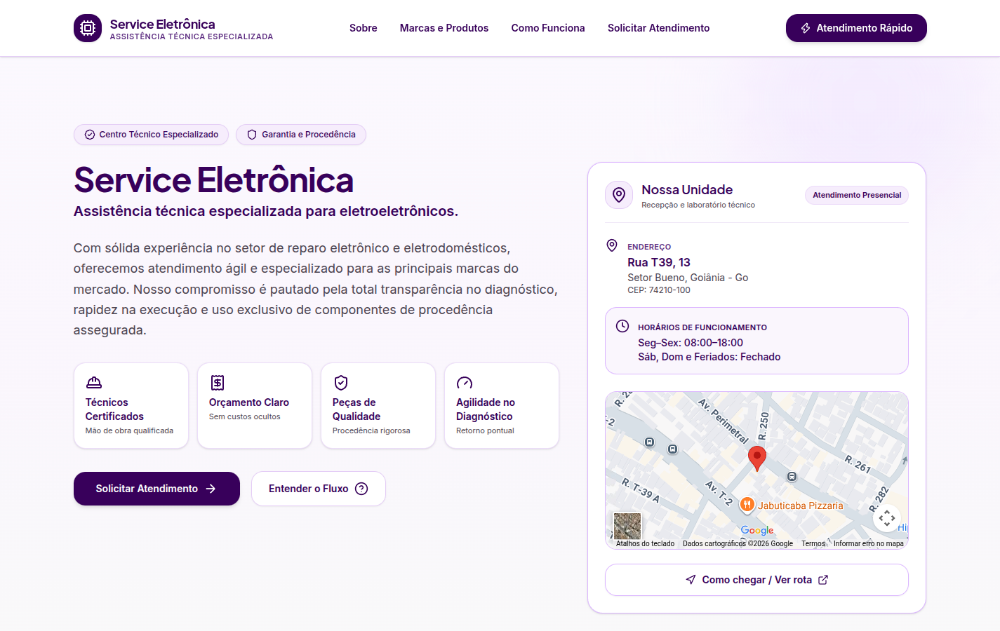
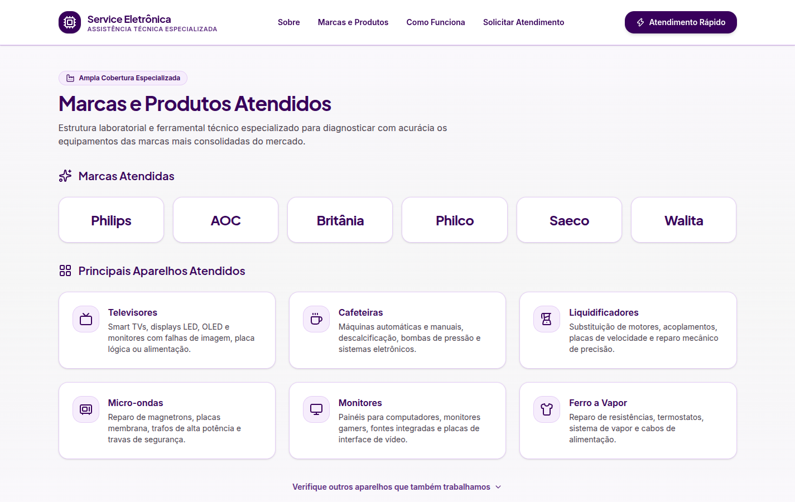
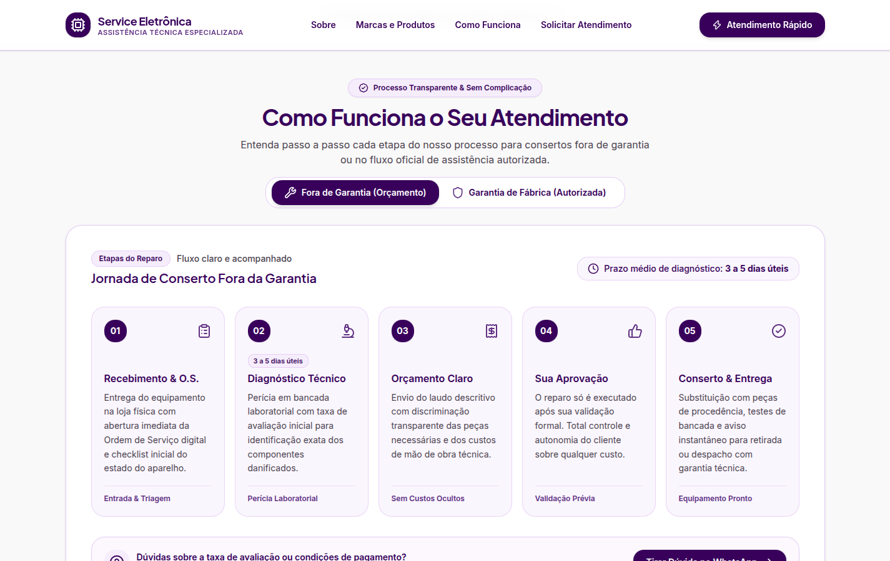
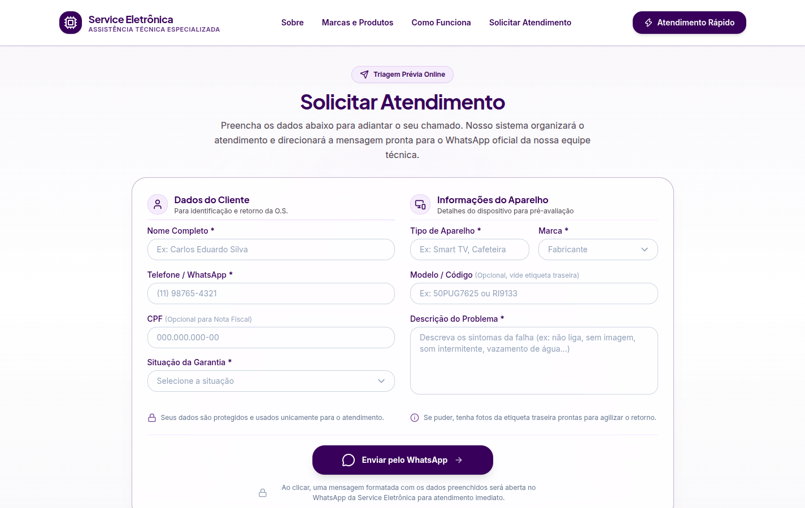
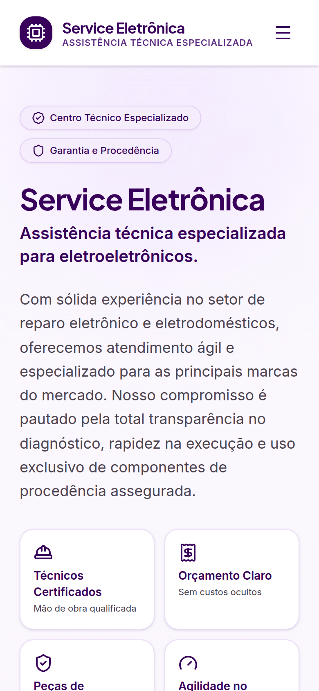
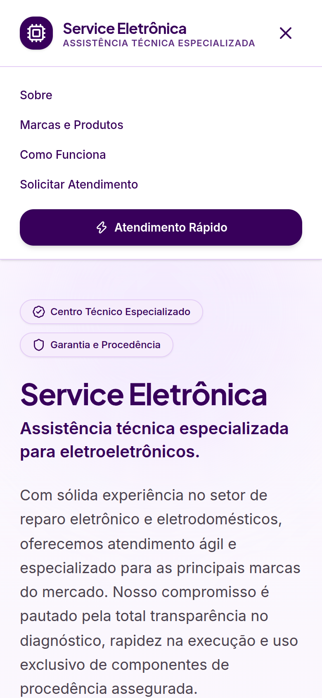
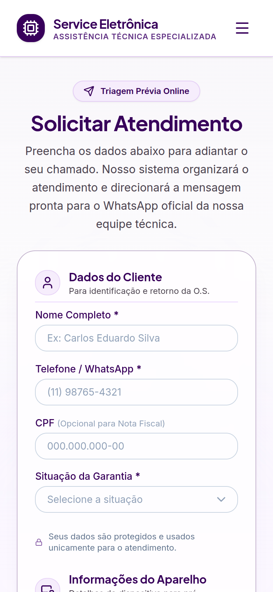

# Service Eletrônica

Landing page institucional da **Service Eletrônica**, assistência técnica de eletroeletrônicos em Goiânia (GO). O site apresenta a empresa, as marcas e aparelhos atendidos, explica o fluxo de atendimento dentro e fora da garantia e permite que o cliente monte uma solicitação de atendimento que é enviada pronta para o WhatsApp da empresa.

[**Acessar aplicação**](https://service-eletronica-lp.vercel.app/) · [**Repositório**](https://github.com/estevaogalves/Service-Eletronica)

> Projeto real de cliente, publicado para fins de portfólio. O código pode ser consultado, mas **não é open source** e não pode ser reutilizado. Veja a seção [Licença](#licença).

---

## Preview

### Desktop

<p align="center">
  
</p>

| Marcas e produtos | Como funciona |
| :---: | :---: |
|  |  |

<p align="center">
  
</p>

### Mobile

| Início | Menu | Solicitar atendimento |
| :---: | :---: | :---: |
|  |  |  |

---

## Sobre o projeto

A Service Eletrônica atende consertos de televisores, monitores, cafeteiras e outros eletroportáteis, tanto em garantia de fábrica (como assistência autorizada) quanto fora da garantia (mediante orçamento).

O site foi desenvolvido para um cliente real e tem três objetivos:

- **Apresentar a empresa** com informações de endereço, horário de funcionamento e localização no mapa.
- **Reduzir dúvidas recorrentes**, explicando quais marcas e aparelhos são atendidos e como funciona cada tipo de atendimento.
- **Agilizar o primeiro contato**: o cliente preenche os dados do aparelho e do problema, e o site gera uma mensagem organizada que é aberta diretamente no WhatsApp da empresa.

É um projeto **exclusivamente frontend**: não há backend, banco de dados ou autenticação. Os dados do formulário não são armazenados — eles são apenas formatados e enviados via link do WhatsApp.

---

## Funcionalidades

- **Navegação por seções** (Sobre, Marcas e Produtos, Como Funciona, Solicitar Atendimento) com rolagem suave que compensa a altura do header fixo e respeita `prefers-reduced-motion`.
- **Menu mobile** com abertura/fechamento e fechamento automático ao navegar.
- **Bloco "Nossa Unidade"** com endereço, horários, mapa do Google Maps incorporado e link "Como chegar".
- **Marcas e aparelhos atendidos**, renderizados a partir de dados centralizados em `src/data`, com lista expansível de outros aparelhos (indicando os que são atendidos somente em garantia).
- **Fluxo de atendimento em abas**:
  - *Fora de garantia*: cinco etapas, do recebimento à entrega, com prazo médio de diagnóstico.
  - *Garantia de fábrica*: requisitos para o atendimento autorizado (nota fiscal, acessórios e triagem).
- **Formulário de solicitação de atendimento**:
  - máscaras de telefone e CPF;
  - seletores personalizados de situação da garantia e marca;
  - montagem de uma mensagem formatada com os dados preenchidos;
  - abertura do WhatsApp da empresa (`wa.me`) com a mensagem pronta.
- **Layout responsivo** para desktop, tablet e mobile.

> **Limitação conhecida:** os campos *Marca* e *Situação da Garantia* são exibidos como obrigatórios, mas ainda não são validados antes do envio. Se não forem selecionados, a mensagem é gerada com esses campos em branco. Os demais campos obrigatórios usam a validação nativa do navegador.

---

## Stack

**Frontend**

- [React 19](https://react.dev/)
- [TypeScript](https://www.typescriptlang.org/)
- [Vite](https://vite.dev/)
- [Tailwind CSS v4](https://tailwindcss.com/) (via `@tailwindcss/vite`), com `tw-animate-css` e o tema base do shadcn (`shadcn/tailwind.css`)
- [Lucide React](https://lucide.dev/) para ícones
- Fontes Inter e Plus Jakarta Sans via [Fontsource](https://fontsource.org/)

**Integrações**

- WhatsApp (deep link `wa.me` com mensagem pré-preenchida)
- Google Maps (iframe incorporado e link de rota)

**Infraestrutura**

- [Vercel](https://vercel.com/) (hospedagem da versão publicada)

**Ferramentas**

- pnpm
- [Oxlint](https://oxc.rs/) (lint)

---

## Arquitetura

Aplicação estática de página única (SPA), sem roteador: a página `Home` compõe as seções e a navegação é feita por âncoras.

```text
Usuário
   ↓
Landing page (React + Vite, hospedada na Vercel)
   ├── Google Maps (iframe e link de rota)
   └── Formulário → mensagem formatada → wa.me → WhatsApp da empresa
```

---

## Estrutura do projeto

```text
src/
├── components/
│   ├── layout/     # Header, Navigation e Footer
│   ├── home/       # Hero (apresentação) e Location (endereço, horários e mapa)
│   ├── brands/     # Marcas, aparelhos atendidos e lista expansível
│   ├── service/    # Abas "Como funciona": fora de garantia e garantia de fábrica
│   └── contact/    # ServiceForm (formulário → WhatsApp)
├── data/           # Dados estáticos: empresa, marcas e produtos
├── lib/            # Utilitários (cn e navegação com scroll)
├── pages/
│   └── Home.tsx    # Composição das seções da página
├── App.tsx
├── main.tsx
└── index.css       # Tailwind, tema e fontes
```

Os arquivos `About.tsx`, `ContactCTA.tsx` e `WhatsAppButton.tsx` existem na estrutura, mas ainda estão vazios e não são utilizados.

---

## Decisões técnicas

- **Sem backend.** O atendimento da empresa já acontece pelo WhatsApp, então o formulário apenas organiza as informações e gera um link `wa.me` com a mensagem codificada (`encodeURIComponent`). Nenhum dado é salvo.
- **Dados centralizados em `src/data`.** Nome, endereço, horários, WhatsApp, marcas e produtos ficam em arquivos próprios e são consumidos pelos componentes. O número do WhatsApp, por exemplo, é usado tanto no formulário quanto no rodapé a partir de uma única fonte.
- **Componentes organizados por domínio** (`layout`, `home`, `brands`, `service`, `contact`) em vez de por tipo de componente.
- **Navegação com compensação do header fixo.** A função `navigateToSection` mede a altura real do header e usa um duplo `requestAnimationFrame` para calcular a posição apenas depois que o menu mobile fecha, evitando que a rolagem ultrapasse o início da seção.
- **Abas sem desmontar o conteúdo.** As duas abas de "Como funciona" ficam sobrepostas no mesmo grid e alternam por opacidade; a aba inativa recebe `inert` e `aria-hidden`, o que evita saltos de layout e remove o conteúdo oculto da navegação por teclado.
- **Seletores personalizados** de marca e garantia com `role="listbox"`/`role="option"`, `aria-expanded` e fechamento ao clicar fora, mantendo o valor em um `input type="hidden"` para leitura via `FormData`.

---

## Como executar

### Pré-requisitos

- Node.js `^20.19.0` ou `>=22.12.0` (exigido pelo Vite)
- pnpm

### Instalação

```bash
git clone https://github.com/estevaogalves/Service-Eletronica.git
cd Service-Eletronica
pnpm install
```

### Desenvolvimento

```bash
pnpm dev
```

A aplicação ficará disponível no endereço exibido pelo Vite (por padrão, `http://localhost:5173`).

### Outros scripts

| Comando | Descrição |
| --- | --- |
| `pnpm build` | Verifica os tipos (`tsc -b`) e gera o build de produção em `dist/` |
| `pnpm preview` | Serve localmente o build de produção |
| `pnpm lint` | Executa o Oxlint |

### Variáveis de ambiente

O projeto não utiliza variáveis de ambiente. Os dados da empresa (endereço, horários, WhatsApp e mapa) ficam em `src/data/company.ts`.

---

## Deploy

A versão publicada está hospedada na **Vercel**:

🌐 [service-eletronica-lp.vercel.app](https://service-eletronica-lp.vercel.app/)

---

## Status

🟢 **Em produção** — primeira versão publicada e acessível na Vercel.

---

## Aprendizados

- Transformar um processo real de atendimento (triagem, garantia e orçamento) em conteúdo e fluxo de interface.
- Integrar um formulário ao WhatsApp sem backend, montando uma mensagem estruturada e codificada para URL.
- Implementar máscaras de entrada e seletores personalizados com atributos de acessibilidade.
- Controlar a rolagem entre seções considerando header fixo, menu mobile e preferência de movimento reduzido.
- Construir layouts responsivos com Tailwind CSS v4, incluindo espaçamentos baseados em `clamp()` e unidades de viewport (`svh`).
- Corrigir diferenças de CSS que só apareciam em navegadores reais, fora do ambiente de desenvolvimento.
- Organizar um projeto React por domínio e centralizar dados estáticos para facilitar a manutenção.

---

## Licença

**Todos os direitos reservados.** Este não é um projeto de código aberto.

Por se tratar de um site desenvolvido para um cliente real, o código está público apenas para fins de portfólio e avaliação profissional. Ele pode ser visualizado, mas não pode ser copiado, modificado, redistribuído ou reutilizado, no todo ou em parte, sem autorização prévia e por escrito do autor.

O nome, a identidade visual, os textos e os dados da Service Eletrônica pertencem à empresa.

Consulte o arquivo [LICENSE](LICENSE) para os termos completos.
